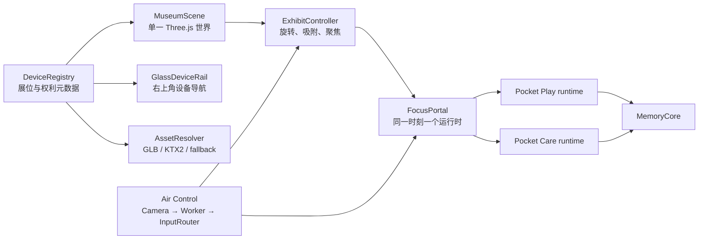

# GameX 开放设备环形博物馆与 Air Control 设计规格

- 日期：2026-07-24
- 状态：设计与书面规格已由用户确认，进入实现计划
- 产品名称：GameX
- 比赛主张：Playable Artifacts of Childhood
- MVP 演示长度：120 秒

## 1. 目标

把当前由 Game Boy 与 Dammagotchi 两个独立 iframe 组成的切换页，升级成一个白色、可 360° 旋转的 Three.js 数字博物馆：

- 8 台复古电子游戏设备同时存在于一个空间。
- 2 台设备可进入并游玩，6 台设备以高质量 Coming Soon 形态出现。
- 每台设备都有可核验的开放许可 3D 资产来源。
- 右上角提供 8 枚玻璃设备图标，并允许未来继续扩展。
- 可玩设备通过场景门户进入，不拆散现有运行时。
- 玩家行为生成 Memory Fragment，让玩法改变中心空间。
- 用户可以主动开启摄像头，用手在 GameX 内模拟鼠标。
- 参赛版明确展示开源来源、许可证、改作记录和第三方作品边界。

12 秒比赛介绍词：

> GameX 不是复古游戏合集，而是一座会记住玩家行为的开放数字博物馆：八件童年设备共处一个可旋转空间，其中两件现在就能进入和玩。

## 2. 当前状态与主要问题

当前根应用通过 `src/main.js` 销毁并重建 iframe，在 Game Boy 与 Dammagotchi 之间切换。两个子项目分别是独立的 WebGL/DOM/音频应用：

- `apps/game-boy`：MIT，原作者 Andrii Babintsev。
- `apps/dammagotchi`：AGPL-3.0。

现状可以运行，但比赛表达仍像两个第三方作品的入口页，而不是一个统一原创产品。主要问题是：

1. 两个体验不在同一可见空间，缺少完整世界观。
2. 右上角切换器只能表达两项，不能自然扩展到更多设备。
3. 现有作品的品牌、角色、商品外观和上游来源具有比赛权利风险。
4. iframe 切换缺少统一的 ready、pause、resume、exit、input 和错误协议。
5. 第三方模型、纹理和运行时没有统一的来源清单与失败降级。
6. 缺少能在短时间内向评委证明创新的因果反馈。

本规格只重构当前展示层、运行时桥接、资产管线和输入层，不重写两个子游戏。

## 3. 已确认的核心设计

### 3.1 空间方向

采用 360° 环形展馆：

- 一个常驻的 Three.js `MuseumScene`。
- 8 个等角分布但高度、轮廓和微交互不同的展位。
- 中央一个 `MemoryCore`。
- 拖拽、触摸或键盘左右键旋转展馆。
- 点击设备或玻璃图标后，相机吸附到精确方位。
- 退出可玩门户后回到进入前的方位，不丢失上下文。

### 3.2 白色视觉系统

白色不是普通网页背景，而是展馆空间本身：

- 70%：纯白与高明度背景。
- 20%：珍珠灰地面、阴影、轮廓线与展台。
- 10%：柠檬绿、青色、紫色等信号色。

约束：

- 不采用深色赛博背景。
- 设备本体是主要色彩焦点。
- 玻璃材质必须在白底上保留边界、阴影和可读对比。
- 信息文字使用深灰而非浅灰。
- Coming Soon 不能只显示文字卡片，必须有可识别的 3D 轮廓和微交互。

### 3.3 右上角玻璃导航

`GlassDeviceRail` 固定在右上角，首发显示 8 枚设备轮廓图标：

- 当前设备使用实色信号背景。
- 其余设备使用白色玻璃与清晰描边。
- 点击图标把环形展馆吸附到对应展位。
- 图标数据来自设备注册表，不写死为两个按钮。
- 多于 8 台时允许横向滚动或折叠为“＋N”，不改变展馆结构。
- 完整支持键盘焦点、`aria-label` 和 `aria-current`。

## 4. 首发 8 个展位

每个展馆外壳均绑定一项明确的开放许可模型。现有两个可玩运行时仍保留各自的项目许可证和署名；展馆外壳与运行时内部模型是两个独立资产层。

| 编号 | 展品名 | 状态 | 开放模型来源 | 许可 | MVP 微交互 |
| --- | --- | --- | --- | --- | --- |
| 01 | Pocket Play | LIVE | 现有模型的固定字节，[Andrii Babintsev / Snokke](https://github.com/Snokke/game-boy-challenge) | MIT | 插卡、开机、按键、进入游戏 |
| 02 | Pocket Care | LIVE | 现有程序化几何的固定源码，[Francesco Dammacco / dammafra](https://github.com/dammafra/dammagotchi) | AGPL-3.0-only | 孵化、照料、进入宠物运行时 |
| 03 | Retro Learning Computer | SOON | [Keyboard / Poly by Google](https://poly.pizza/m/3oFfQCSsUmQ) | CC BY 3.0 | 键帽逐行点亮、学习卡悬浮入仓 |
| 04 | Cartridge Home Console | SOON | [Videogame / Poly by Google](https://poly.pizza/m/7jHiQIMZkRs) | CC BY 3.0 | 仓门开合、双控制器呼吸 |
| 05 | Wide Handheld | SOON | [Retro Handheld / Michael Fuchs](https://poly.pizza/m/2nwiJ7W4kkz) | CC BY 3.0 | 摇杆视差、屏幕扫描信号 |
| 06 | Dual LCD Pocket | SOON | [Handheld videogame console / Poly by Google](https://poly.pizza/m/5kxD7n4F3lv) | CC BY 3.0 | 开盖、双屏显示不同段码 |
| 07 | Block Matrix Handheld | SOON | [Handheld game console / Poly by Google](https://poly.pizza/m/fw194G1mJA9) | CC BY 3.0 | 点阵重组为 Coming Soon |
| 08 | Arcade Terminal | SOON | [Arcade Machine / J-Toastie](https://poly.pizza/m/GLDkMhiynM) | CC BY 3.0 | 摇杆轻摆、原创吸引画面 |

早期初选的 ItsKevin、N01516、jampakdd 与 alikulovd4 模型无法同时建立“不可变原始字节、全离线重建、去商标加工与许可证证据”的闭包，因此已按规则 5 换成上表可固定输入。替换只改变资产来源，不改变八个设备类别、LIVE/SOON 状态或既定 MVP 微交互。

资产使用规则：

1. 模型页、作者、许可证、下载日期、原始哈希和修改后哈希必须进入资产清单。
2. 删除 Nintendo、Bandai、Tetris、Subor 等名称、Logo、专有贴图和可识别游戏画面。
3. 改动模型比例、控制区、材质和细节，使展品成为原创类别表达，而不是忠实商品复制。
4. CC BY 只覆盖作者有权授权的模型表达，不自动授权商标、商品外观、角色、ROM 或屏幕内容。
5. 某个模型在下载或权利复核阶段不合格时，直接替换成另一项已核验开放资产；不能使用许可证不明或仅标“免费”的模型。
6. 程序化玻璃外壳只用于首屏骨架和错误降级，不代替“每台设备都有开放模型”的要求。

调研证据保存在 `sources/research_retro_device_models_2026-07-24.md`。

## 5. 120 秒评委体验

| 时间 | 体验 | 必须证明的内容 |
| --- | --- | --- |
| 00–08 秒 | 白场中显现环形展馆和 8 台设备 | 这是一个统一世界，不是 iframe 菜单 |
| 08–40 秒 | 玻璃图标吸附到 Pocket Play，相机推入并完成短交互 | 设备是可进入的活文物 |
| 40–52 秒 | 交互产生 Memory Fragment，飞入中央核心 | 玩法会改变空间 |
| 52–86 秒 | 进入 Pocket Care 并完成一次照料 | 同一门户协议承载不同运行时 |
| 86–110 秒 | 旋转扫过 6 个 Coming Soon 展位 | 开放设备谱系与可扩展性 |
| 110–120 秒 | 回到八台全景、Memory Core 和比赛主张 | 完成产品记忆点 |

Air Control 作为演示加分路径：

1. 评委主动点击 `Enable Air Control`。
2. 张手移动空气光标。
3. 握拳按住，移动拳头拖动环形展馆。
4. 对准设备后完成一次“握拳 → 张手”，等价于点击。
5. 如果场地、权限或光线不适合，立即使用鼠标继续，不影响主流程。

## 6. 比赛创新

### 6.1 Play Changes Place

可玩互动会生成 `MemoryFragment`。碎片记录最小语义事件，例如：

- 来源设备。
- 事件种类。
- 发生时间。
- 颜色和能量。

碎片改变 `MemoryCore` 的光、形态和地面轨迹。评委必须在第一次游玩后的 40–52 秒内看到清楚的因果关系。

### 6.2 Runtime-to-Object Bridge

现有 Web 游戏不是独立页面入口，而是设备屏幕中的运行时。展馆、设备、相机和记忆核心保持连续；只有聚焦后的屏幕区域启动当前子应用。

### 6.3 Open Museum Protocol

设备注册表同时生成：

- 展位。
- 玻璃导航。
- 展签。
- 模型加载。
- 运行时门户。
- 署名页。

MVP 与本轮比赛发布门禁固定为正好 8 台；注册表、环形布局、控制器和玻璃导航原语均按 `records.length` 运行。未来版本把发布计数从 8 调整为新目标后，新增第 9 台设备只增加一条注册数据和对应资产，不改展馆核心架构。

### 6.4 Air Control

手掌在 GameX 内模拟鼠标，使“触摸童年设备”成为无需实体控制器的空间交互。该功能只模拟应用内指针，不控制操作系统鼠标。

## 7. 总体架构



### 7.1 DeviceRegistry

注册表是单一事实来源。每条记录必须包含：

```text
id
exhibitNumber
name
year
status: live | coming-soon
azimuth
icon
modelUrl
creator
license
licenseUrl
sourceUrl
originalSha256
modifications
outputSha256
trademarkRemoved
reviewStatus
runtimeUrl
runtimeCapabilities
interactionHint
```

校验规则：

- `creator`、`license`、`licenseUrl`、`sourceUrl` 或哈希缺失时，外部模型不得进入正式展馆。
- `LIVE` 必须提供运行时地址和能力声明。
- `COMING_SOON` 不得提供可误导用户的 Play 按钮。
- 方位角不能重复，且首发必须正好有 8 个有效展位。

### 7.2 MuseumScene

职责：

- 创建唯一的展馆 renderer、canvas、camera、lights 和 render loop。
- 渲染环形地面、8 个展台、设备模型、Memory Core 与氛围效果。
- 在 FocusPortal 激活时保持挂载，但降低刷新率并暂停高成本效果。
- 设备远景、中景和聚焦态使用不同 LOD。
- 每台设备创建独立、不可见但可 raycast 的 proxy box；`Three.Raycaster` 只命中这些简单代理，复杂 GLB 永不直接参与点击。
- 为每台设备保留屏幕 anchor，并提供 `focusExhibit(id)`、`restoreOverview()` 与 `getProjectedScreenRect(id)`（或严格等价 API），让门户层对齐相机投影后的设备屏幕。

### 7.3 AssetResolver

加载流程：

1. 立即显示程序化玻璃骨架，保证首屏不空白。
2. 通过 `LoadingManager` 请求注册表中的 GLB。
3. 使用 `GLTFLoader`，按资产支持启用 Meshopt 或 Draco。
4. 纹理优先使用 KTX2/Basis。
5. 标准化比例、中心、朝向、材质和可交互节点。
6. 加载成功后交叉淡入开放模型。
7. 404、解码、许可校验或性能失败时保留玻璃替身，并显示“资料修复中”。

### 7.4 ExhibitController

统一管理鼠标、触摸、键盘和 Air Control：

- 拖拽改变环形方位。
- 松手后吸附到最近展位。
- 点击玻璃图标直接吸附目标方位。
- 指针移动不超过 6 CSS px、且 down/up 命中同一 proxy box 才判定为设备点击；超过阈值就是拖拽，不得误入聚焦。
- 点击设备与点击玻璃图标都先选择并吸附目标方位；进入门户再执行相机聚焦。
- `Escape` 退出门户并恢复进入前方位。
- 减少动态模式关闭惯性和大幅相机推进。

### 7.5 FocusPortal

两个现有子应用拥有独立 WebGL、DOM 和音频生命周期。首轮比赛版不把它们强行合并到同一个 renderer，而采用一个视觉连续的门户：

1. 相机推进到设备屏幕。
2. 在设备屏幕区域挂载当前 iframe/CSS 层。
3. 同一时刻最多存在一个活动运行时。
4. 父场景继续挂载，但暂停高成本动画和空间音频。
5. 退出时销毁或暂停运行时，恢复父场景和相机方位。

父子协议：

```text
gamex:hello
gamex:ready
gamex:capabilities
gamex:pause
gamex:resume
gamex:exit
gamex:memory
gamex:input
gamex:release-all
gamex:error
```

所有消息包含协议版本、序号和时间戳；接收端必须验证 `origin` 与 `event.source`。

## 8. Air Control：手模拟鼠标

### 8.1 明确边界

浏览器不能移动操作系统真实光标，也不能产生受信任的系统点击。Air Control 在 GameX 内输出与鼠标等价的归一化指针语义：

```text
move
down
up
release-all
```

这些语义覆盖展馆和当前 FocusPortal，但不会影响浏览器标签页或其他应用。

### 8.2 手势映射

只跟踪一只手：

- 掌心位置：由腕点与四个掌指关节的中心计算，镜像到屏幕坐标，再通过 One Euro Filter 平滑。
- 张手 `Open_Palm`：移动和悬停，`buttons = 0`。
- 握拳 `Closed_Fist`：发送一次 `down`，随后维持 `buttons = 1`。
- 握拳移动：持续发送按下状态的 `move`，用于拖拽展馆或设备控件。
- 重新张手：发送一次 `up`。
- “握拳 → 张手”且移动距离低于点击阈值：按普通左键点击处理。

初始工程参数：

- `Closed_Fist` 置信度不低于 0.75，并连续稳定约 150ms 后按下。
- `Open_Palm` 置信度不低于 0.55，并连续稳定约 100ms 后释放，形成迟滞并避免在边界反复切换。
- 同一次持续握拳只发送一次 `down`。
- 同一次释放只发送一次 `up`。
- 单次点击冷却 250ms。
- 跟踪丢失 250ms、Worker 异常、切换设备、iframe 重载、页面隐藏、关闭摄像头或按 `Escape` 时立即 `release-all`。

这些阈值是实现初值，不是模型官方保证；必须通过真实用户样本校准。

### 8.3 技术实现

采用 `@mediapipe/tasks-vision@0.10.35` 的 `GestureRecognizer`：

- 运行模式：`VIDEO`。
- `numHands: 1`。
- 仅允许 `Closed_Fist` 与 `Open_Palm` 参与状态转换。
- 同一个结果已包含手势、左右手和 21 个关键点，不再并行运行 Hand Landmarker。
- SDK、WASM 和 `.task` 模型自托管并锁定版本，不使用 `latest` CDN。
- 模型约 8.37MB，仅在用户启用 Air Control 后懒加载，不计入展馆首屏 4MB 预算。

Web 端 `recognizeForVideo()` 是同步调用，因此必须在模块 Web Worker 中运行：

1. 顶层 Hub 通过用户点击调用 `getUserMedia`。
2. 摄像头请求只包含视频，使用 640×480 和 15–30fps 软约束。
3. `requestVideoFrameCallback()` 产生帧；旧浏览器回退到 RAF。
4. 每次向 Worker 传递一个 `ImageBitmap`。
5. 同一时刻最多一帧在途，不建立帧队列。
6. Worker 处理完后关闭 bitmap，再允许下一帧。
7. 默认使用 CPU/WASM 路径，避免与 Three.js 抢占 GPU；只在目标设备实测通过后启用其他 delegate。

模块边界：

```text
CameraSession
  → GestureWorker
  → GestureStateMachine
  → AirInputAdapter
  → InputRouter
  → MuseumScene 或当前 FocusPortal
```

统一输入消息：

```json
{
  "type": "gamex:input",
  "v": 1,
  "source": "air-control",
  "phase": "move",
  "nx": 0.5,
  "ny": 0.5,
  "buttons": 0,
  "seq": 42,
  "timestamp": 1784880000000
}
```

`nx`、`ny` 为 0–1 归一化坐标。子应用必须提供显式适配器，把命中后的 down/up 映射到现有按钮 API；不伪造系统级鼠标或键盘事件，不使用 MutationObserver 猜测 canvas。

### 8.4 摄像头权限与隐私

- Air Control 默认为关闭。
- 只有点击 `Enable Air Control` 后才请求摄像头。
- 使用 `audio: false`，不请求麦克风。
- 页面必须位于 HTTPS 或 localhost 安全上下文。
- 摄像头由顶层 Hub 所有，子 iframe 不单独请求权限。
- 视频帧、截图和关键点不上传、不录制、不持久化。
- UI 常驻绿色摄像头状态灯、识别状态与 `Stop Camera`。
- 停止功能时对全部 video track 调用 `stop()`，并清空 `video.srcObject`。
- 页面隐藏时先 `release-all`，停止摄像头；返回页面后不自动恢复，等待用户再次启用。
- 权限拒绝、忽略、永久阻止、无设备或设备占用时，显示非阻断提示并保留鼠标、触摸和键盘。
- 部署时设置 `Permissions-Policy: camera=(self)`。

## 9. Memory Core 数据流

子运行时只发送语义事件，不直接操作父场景：

```json
{
  "type": "gamex:memory",
  "v": 1,
  "deviceId": "pocket-play",
  "event": "interaction-complete",
  "energy": 0.7,
  "color": "#d9ff57",
  "timestamp": 1784880000000
}
```

父场景验证来源后创建 `MemoryFragment`。MVP 不保存个人身份，只允许把展馆的聚合视觉状态存到本地存储；损坏或未知版本的数据直接忽略并恢复默认状态。

## 10. 性能预算

这些是项目验收目标：

- 展馆首屏 GLB 与纹理总下载量不超过 4MB。
- Air Control 模型仅在启用后懒加载。
- 中景单设备不超过 25k triangles 和一张 1024² 主贴图。
- 聚焦单设备不超过 50k triangles；只有聚焦时允许 2048²。
- `devicePixelRatio` 上限为 1.5。
- 同一时刻一个父场景 renderer、一个活动子运行时。
- Air Control 有效识别目标为 15–20fps，且同一时刻最多一帧在途。
- 旋转、图标吸附和普通指针移动目标为 60fps；低性能设备允许 30fps 降级。
- 重复展台、灯环和地面标记使用 `InstancedMesh`。
- 模型采用可复现的 `inspect → prune/dedup → compress → texture resize/KTX2 → validate` 流程。

## 11. 错误处理

| 故障 | 用户可见结果 | 系统行为 |
| --- | --- | --- |
| GLB 404 或解码失败 | 保留玻璃设备并显示“资料修复中” | 记录资产 ID，不影响其他展位 |
| 许可字段缺失 | 不加载外部模型 | fail closed，显示玻璃替身 |
| 子运行时超时 | 屏幕显示 Retry / Back | 销毁失败 iframe，恢复父场景 |
| 子运行时崩溃 | 返回设备聚焦态 | `release-all`、恢复音频和相机 |
| 摄像头拒绝或不可用 | Air Control 不可用提示 | 继续鼠标、触摸、键盘 |
| Worker 或模型加载失败 | 隐藏空气光标并提示重试 | 停止轨道、`release-all` |
| 手势跟踪丢失 | 空气光标变灰 | 250ms 后强制释放 |
| 页面进入后台 | Air Control 关闭 | 停止摄像头和推理 |
| 本地状态损坏 | 使用默认 Memory Core | 忽略损坏数据 |

任何错误都不能产生空白整页或卡住的按键状态。

## 12. 可访问性

- 鼠标、触摸和键盘是完整主路径；摄像头永远不是使用门槛。
- 所有设备图标、展位和门户按钮具有可读名称与可见焦点。
- `Enter` 进入，`Escape` 退出，左右键切换展位。
- 提供减少动态、高对比和静音开关。
- 减少动态模式关闭相机大幅推进、惯性旋转和高频碎片轨迹。
- Air Control 状态不能只靠颜色表达，必须同时显示文字或图标。
- 摄像头预览允许隐藏，但状态灯和停止按钮始终可见。

## 13. 权利与比赛披露

参赛前必须完成：

1. 把 Game Boy 与 Dammagotchi 上游项目、作者、许可证和修改写入根级 `CREDITS.md`。
2. 遵守 Dammagotchi 的 AGPL-3.0 源码提供义务。
3. 删除“GameX 原创制作了全部设备/游戏”一类错误声明。
4. 将对 Game Boy、Tamagotchi、Tetris、Nintendo、Bandai 等名称的展示改成历史说明或内部来源说明，面向评委的展品使用 Pocket Play、Pocket Care 等原创名。
5. 不分发来源不明的 ROM、角色素材、商品扫描或厂商贴图。
6. 为每个 3D 资产保留作者、来源、许可证、修改、哈希和商标删除记录。
7. 在比赛说明中明确：GameX 的原创贡献是展馆系统、运行时桥接、Memory Core、开放设备协议、Air Control 与整体叙事；两款子应用来自开放许可上游并经整合改造。

## 14. 测试设计

### 14.1 单元测试

- 注册表 8 项、唯一 ID、唯一方位和必填许可证字段。
- 发布门禁仍锁定 8/8；另以至少 10 条 synthetic records 验证注册表、环形布局、控制器与玻璃导航不依赖硬编码八项，且导航溢出仍可访问。
- 方位吸附、环形索引和返回原方位。
- proxy-only Raycaster、6 px click-vs-drag 判定、相机聚焦/恢复和屏幕投影矩形。
- 模型成功、许可失败、404 和超预算降级。
- FocusPortal 状态机和同一时刻只允许一个运行时。
- `postMessage` 版本、来源、序号和未知消息拒绝。
- Memory Fragment 事件验证与损坏本地状态恢复。
- Air Control 的迟滞、去抖、单次 down/up、点击判定和 `release-all`。

### 14.2 集成测试

- 右上角 8 个图标与 8 个展位一一对应。
- 点击 canvas 设备或右上图标都选择并吸附同一展位；复杂 GLB 不进入 Raycaster。
- 拖拽、触摸、键盘和 Air Control 都驱动同一个 ExhibitController。
- Pocket Play 与 Pocket Care 分别完成“吸附 → 相机聚焦 → 屏幕范围门户 → ready → 交互 → memory → exit → 全景恢复”。
- 切换运行时前旧运行时完成 pause/销毁和释放输入。
- 模型与子运行时失败时没有空白画面。
- 减少动态与高对比开关覆盖核心路径。

### 14.3 Air Control 真机矩阵

| 维度 | 必测场景 |
| --- | --- |
| 浏览器 | macOS Chrome、Safari；Windows Chrome、Edge；Android Chrome；iOS Safari；Firefox 降级 |
| 权限 | 允许、拒绝、忽略、永久阻止、无摄像头、设备占用、运行中撤权 |
| 资源 | 模型/WASM 404、离线冷启动、缓存命中、Worker 初始化失败 |
| 手势 | 无手、张手、20 次开合拳、握拳 5 秒、左右手、多手、遮挡、边缘、低光、运动模糊 |
| 指令 | 每次开合严格一对 down/up；丢手、切设备和刷新都 release |
| 生命周期 | iframe ready 前、运行时切换、页面后台/恢复、关闭 Air Control |
| 性能 | 游戏 FPS、p50/p95 推理时间、有效识别 FPS、长任务、内存、10 分钟热稳定性 |
| 隐私 | 网络面板无图像上传；关闭后摄像头灯熄灭；不持久化帧或关键点 |

## 15. MVP 范围

必须实现：

- 一个白色 360° 环形展馆。
- 8 个开放资产支持的展位。
- 右上角 8 枚玻璃设备图标。
- Pocket Play 与 Pocket Care 两个可玩门户。
- 6 个 Coming Soon 微交互。
- 一个能被两款游戏事件改变的 Memory Core。
- 鼠标、触摸、键盘和 Air Control 统一输入。
- 资产署名、许可证清单与错误降级。
- 一套可离线运行的比赛演示包。

明确不做：

- 多人同步、账号、云存档或社交系统。
- 让 6 个 Coming Soon 在本轮全部可玩。
- 真实 ROM 模拟器扩张或更多厂商游戏内容。
- 自定义手势模型、双手组合、挥手或复杂动态手势。
- 操作系统级鼠标控制。
- 关卡编辑器、用户上传模型或在线资产市场。
- 忠实复刻小霸王、Nintendo、Bandai 或其他厂商设备。

## 16. 验收标准

设计实现完成必须同时满足：

1. 首屏在一个白色 Three.js 空间看到全部 8 台设备。
2. 拖拽一圈可完成 360° 旋转，8 个图标均能精确吸附。
3. 8 台设备均有注册表记录、开放模型、作者、许可证、来源和哈希。
4. 任一模型加载失败不会导致空展位或空白页面。
5. 同一时刻最多一个子运行时活跃。
6. 两个可玩门户均能 ready、pause、resume、exit 和发送 memory 事件。
7. 第一次可玩互动后，Memory Core 在 2 秒内出现清楚变化。
8. Air Control 必须由用户主动启用；张手移动、握拳 down、保持拳头继续 held move、张手 up。
9. 任意丢手、错误、切换、后台或停止摄像头都会 `release-all`。
10. 摄像头帧、截图和关键点没有上传或持久化。
11. 没有摄像头或权限被拒绝时，完整体验仍可用鼠标、触摸和键盘完成。
12. 120 秒演示可以离线完成，控制台没有未处理错误。
13. 构建、结构验证、核心交互测试和真机性能检查通过。
14. 比赛包包含根级署名、许可证、第三方来源与原创贡献说明。

## 17. 官方技术依据

- MediaPipe Gesture Recognizer Web：<https://developers.google.com/edge/mediapipe/solutions/vision/gesture_recognizer/web_js>
- MediaPipe Gesture Recognizer 概览与模型：<https://developers.google.com/edge/mediapipe/solutions/vision/gesture_recognizer>
- MediaPipe 官方 Web Worker 示例：<https://github.com/google-ai-edge/mediapipe-samples-web/blob/main/src/workers/gesture-recognizer.worker.ts>
- `getUserMedia`：<https://developer.mozilla.org/en-US/docs/Web/API/MediaDevices/getUserMedia>
- W3C Media Capture：<https://www.w3.org/TR/mediacapture-streams/>
- Three.js GLTFLoader：<https://threejs.org/docs/pages/GLTFLoader.html>
- Three.js KTX2Loader：<https://threejs.org/docs/pages/KTX2Loader.html>
- Three.js LoadingManager：<https://threejs.org/docs/pages/LoadingManager.html>
- Three.js Raycaster：<https://threejs.org/docs/pages/Raycaster.html>
- Three.js InstancedMesh：<https://threejs.org/docs/pages/InstancedMesh.html>
- glTF 2.0：<https://registry.khronos.org/glTF/specs/2.0/glTF-2.0.html>
